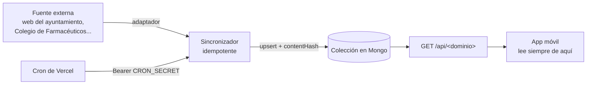

Parte del contenido de la app no lo crea nadie a mano: se **sincroniza automáticamente** desde fuentes oficiales. Todo ese contenido sigue el mismo patrón.

## El patrón

1. **Adaptador** — un cliente del origen (`lib/services/<dominio>/`) que normaliza el dato a la forma del schema Zod. Puede haber **varios adaptadores por dominio** con orden de preferencia (uno principal, otro "best-effort" que tolera fallos y cede el turno).
2. **Sincronizador idempotente** — hace `upsert` por una clave natural (`(juego, fecha)`, `ideess`, `guid`…) con un `contentHash`: si el contenido no cambió, no reescribe. Aislado por elemento — un fallo puntual no aborta el resto. Marca `deletedAt` lo que desaparece del feed tras una sincronización correcta.
3. **Cron** — un endpoint `GET /api/cron/sincronizar-<dominio>`, autorizado con `Authorization: Bearer <CRON_SECRET>` (o sesión de admin), con su entrada en `vercel.json`.
4. **Caché en Mongo** — el resultado vive en una colección propia. **La app nunca llama a la fuente externa**: siempre lee de esta colección vía `GET /api/<dominio>`, con consulta por proximidad / municipio / provincia.

## Qué se sincroniza hoy

| Contenido | Origen | Frecuencia aprox. |
| --- | --- | --- |
| **Noticias** del ayuntamiento | Web / feed oficial de cada municipio | Diaria |
| **Agenda** de eventos | Fuente oficial del ayuntamiento | Diaria |
| **Esquelas** | Funerarias | Varias veces al día |
| **Farmacias de guardia** | Colegio de Farmacéuticos de Gipuzkoa | Diaria (TTL de 12 h en el cliente) |

## Disparo manual

Cada dominio tiene además un endpoint admin `POST /api/<dominio>/sincronizar` y, normalmente, una página de admin con el **estado de frescura** por elemento y un botón "Sincronizar ahora".

## Frescura del dato

La respuesta de la API distingue dos marcas de tiempo:

- **`fetchedAt`** — cuándo sincronizó Herrikonekt por última vez.
- **La fecha oficial del dato** (`Fecha`, `actualizadoEn`, `fecha`…) — cuándo lo publicó/actualizó la fuente.

Así la app puede mostrar "actualizado hace X" con honestidad, incluso si la fuente lleva días sin cambiar.

## Consideraciones legales

Cada fuente tiene su licencia y su exigencia de atribución. Como norma:

- Los **datos objetivos** (precios, resultados, mareas, guardias) son hechos reutilizables; se pueden redistribuir.
- Hay que **atribuir la fuente** cuando la licencia lo pide (CC-BY: Open Data Euskadi, AEMET, IGN…).
- **No** se usan marcas ni logotipos oficiales, ni se da a entender respaldo oficial.
- Contenido de terceros con términos restrictivos (p. ej. Wikiloc) queda descartado como fuente.

## Este patrón y las funcionalidades futuras

Las cuatro [funcionalidades futuras](/futuro/gasolineras) estudiadas (gasolineras, playas, loterías, turismo) están pensadas para seguir **exactamente este patrón**: por eso su viabilidad técnica es alta — la infraestructura de ingesta ya existe y está probada con noticias, agenda, esquelas y farmacias.
