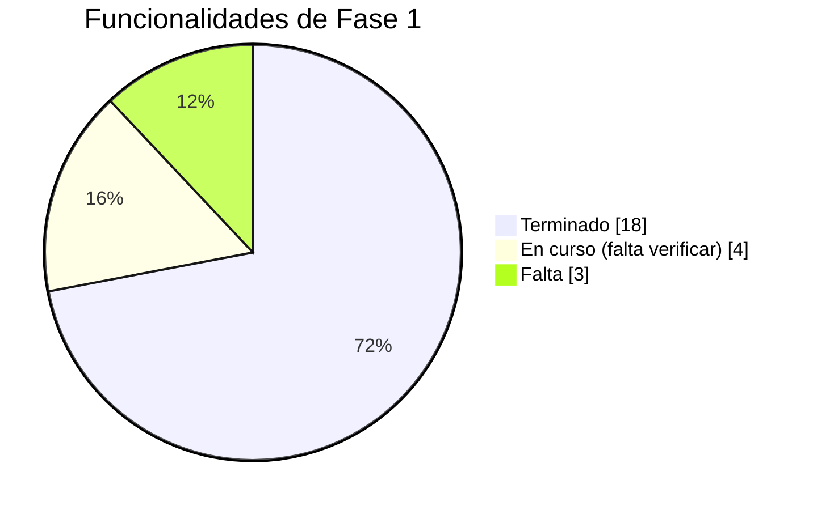
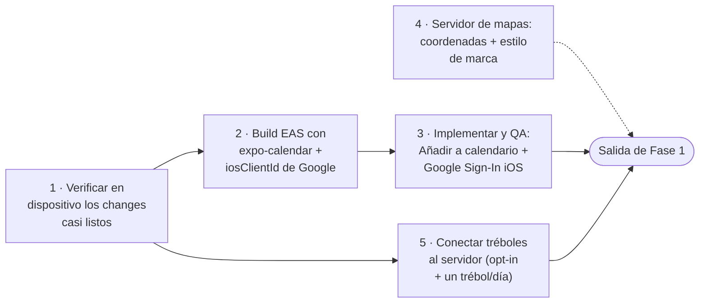

Resumen del estado de la app a partir del código y de los cambios de OpenSpec del repositorio. El detalle de cada punto está en su página de *Funcionalidades*.

<Note>
  Convención: **Listo** = funciona en la app · **En curso** = parcialmente hecho o pendiente de verificación · **Pendiente** = definido pero no operativo.
</Note>

## Cómo vamos

<Note>
  **Fase 1** = la app que existe hoy (todo lo de *Funcionalidades*), terminada y verificada en dispositivo.
  **Fase 2** = las [funcionalidades futuras](/futuro/gasolineras) y lo aplazado (foro "Siguiendo", alertas de noticias, monetización).
</Note>

El alcance funcional de Fase 1 está **~85 % hecho**: 18 funcionalidades terminadas, 4 a falta solo de verificación en dispositivo, y 3 aún por implementar (tréboles, "Añadir a calendario", Google Sign-In en iOS). El camino a la salida es sobre todo **verificación** y **un build nativo**.

### Camino a la salida de Fase 1

| Paso | Qué es | Estado |
| --- | --- | --- |
| 1 | Verificar en dispositivo: reclamar comercio (envío multipart), rendimiento de listados, tipografía | 🟡 En curso |
| 2 | Un build EAS que incluya `expo-calendar` + `iosClientId` de Google | 🔴 Pendiente |
| 3 | Implementar y QA de "Añadir a calendario" y "Google Sign-In iOS" con ese build | 🔴 Pendiente |
| 4 | Follow-ups de servidor de mapas: coordenadas de comercios + estilo de mapa de marca | 🟡 En curso |
| 5 | Conectar tréboles al servidor: opt-in en el perfil + modelo "un trébol al día" | 🔴 Pendiente |

Fuera de Fase 1 (van a Fase 2): alta de comercio por API, foro "Siguiendo", filtros/alertas de noticias, monetización. El seguimiento operativo de todo esto está en el change `roadmap-pendientes` de OpenSpec.

## Terminado

| Funcionalidad | Notas |
| --- | --- |
| [Directorio de comercios](/funcionalidades/comercios) | Buscador, tipos de comercio, listado paginado y cacheado. |
| [Ficha de comercio](/funcionalidades/comercios) | Horario, contacto (llamar/email/web/redes), fotos, descripción multiidioma, servicios, distintivo premium. |
| [Mapa del comercio](/funcionalidades/comercios) | Thumbnail en la ficha + botón "Cómo llegar" (Apple/Google Maps). Depende de que el servidor cargue coordenadas. |
| [Anuncios / ofertas](/funcionalidades/comercios) | Carrusel en Inicio, filtrado por municipio. |
| [Comercio destacado (premium)](/funcionalidades/comercios-destacados) | Distintivo visual dorado (`esDestacado`). Sin pago en la app. |
| [Favoritos (trébol)](/funcionalidades/favoritos) | Marcar/desmarcar ilimitado, gate de login con repetición, sincronización por servidor. |
| [Reclamar un comercio](/funcionalidades/tu-comercio) | Formulario con motivo + documento acreditativo, seguimiento en "Mis comercios". |
| [Agenda de eventos](/funcionalidades/agenda) | Mini-calendario, filtro por día, próximos eventos, detalle con contenido HTML. |
| [Noticias](/funcionalidades/noticias) | Listado, artículo completo por idioma, deduplicación multiidioma, banda de idioma de reserva. |
| [Farmacias de guardia](/funcionalidades/farmacias) | Guardia del día, modo día/noche, llamada directa. |
| [Esquelas](/funcionalidades/esquelas) | Listado y detalle por municipio, compartir, enlace al origen. |
| [Taxis](/funcionalidades/taxis) | Listado, "Pedir taxi", ruta a la parada. |
| [Foro](/funcionalidades/foro) | "La Plaza", publicar, responder, reportar, filtro por tema, moderación visible. |
| [Notificaciones del foro](/funcionalidades/notificaciones) | Push de respuestas, marcar leídas, badge en Perfil. |
| [Perfil y cuenta](/funcionalidades/perfil) | Registro/login (email, Apple, Google en Android), edición de perfil, opt-out de analítica. |
| Cerrar sesión visible | Fila propia en Perfil con confirmación (antes solo en "Editar perfil"). |
| Rendimiento de listados | Listado de comercios virtualizado, cards memoizadas, caché de thumbnails de mapa, splash nativo. |
| Módulos nativos preinstalados | `expo-camera`, `expo-document-picker`, `expo-sharing` listos para un uso futuro. |

## En curso

| Funcionalidad | Qué falta |
| --- | --- |
| [Reclamar un comercio](/funcionalidades/tu-comercio) | Reconfirmar el envío del documento (multipart) en dispositivo iOS y Android. |
| [Mapa del comercio](/funcionalidades/comercios) | Alojar el estilo de mapa de marca (hoy usa un estilo público de reserva); confirmar que el servidor rellena coordenadas para los comercios existentes. |
| Rendimiento / limpieza | Recorrido manual de verificación en dispositivo pendiente. |
| Módulos nativos preinstalados | Falta el build EAS de validación. |

## Pendiente

| Funcionalidad | Situación |
| --- | --- |
| [Tréboles (impulso / ranking)](/funcionalidades/treboles) | El servidor tiene el contrato; en la app falta el modelo "un trébol al día", el opt-in en el perfil, los estados del botón y la verificación. Hoy el botón guarda favoritos. |
| [Añadir evento al calendario](/funcionalidades/agenda) | No funciona en iOS (no abre nada) y en Android depende del navegador. Pendiente reescribir con `expo-calendar` + build nativo nuevo. |
| [Google Sign-In en iPhone](/funcionalidades/perfil) | Falla con `failed to determine clientID`; falta configurar el client ID de iOS + build nativo nuevo. En Android funciona. |
| [Alta de comercio nuevo](/funcionalidades/tu-comercio) | Todavía se envía por correo, sin formulario conectado a la API. |
| [Foro — pestaña "Siguiendo"](/funcionalidades/foro) | Muestra "muy pronto"; no se puede seguir a personas ni temas. |
| [Noticias — filtros y alertas](/funcionalidades/noticias) | Textos traducidos, sin UI: filtro por categoría, favoritos de noticias, alertas push por categoría. |
| [Monetización](/funcionalidades/comercios-destacados) | Sin definir. RevenueCat instalado sin usar; el pago del destacado vive fuera de la app; sin planes de usuario. |

## Requiere un build nativo nuevo

Algunos pendientes cambian código nativo y **no** se pueden entregar como actualización OTA: "Añadir a calendario" (`expo-calendar`) y "Google Sign-In en iOS". Los development builds anteriores quedarán desactualizados cuando se genere el siguiente.
