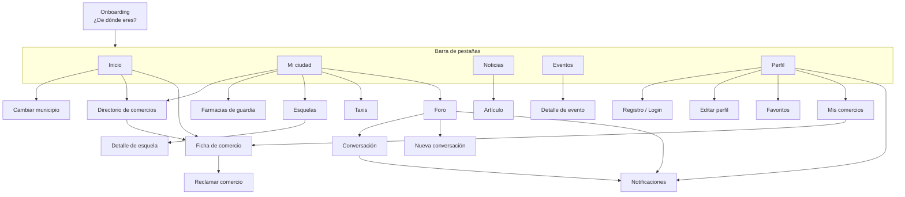

Esta sección describe **qué hay en cada pantalla** de la app. Es una referencia complementaria a _Funcionalidades_: aquí el eje es la pantalla, no el caso de uso.

## Estructura de navegación

## Todas las pantallas

| Pantalla | Ruta | Cómo se llega | Detalle |
| --- | --- | --- | --- |
| Onboarding | `onboarding` | Primer arranque, sin municipio | [Pestañas](/pantallas/pestanas#onboarding-de-dónde-eres) |
| Inicio | `(tabs)/index` | Pestaña 1 | [Pestañas](/pantallas/pestanas#inicio) |
| Mi ciudad | `(tabs)/businesses` | Pestaña 2 | [Pestañas](/pantallas/pestanas#mi-ciudad) |
| Noticias | `(tabs)/news` | Pestaña 3 | [Pestañas](/pantallas/pestanas#noticias) |
| Eventos | `(tabs)/agenda` | Pestaña 4 | [Pestañas](/pantallas/pestanas#eventos) |
| Perfil | `(tabs)/profile` | Pestaña 5 | [Pestañas](/pantallas/pestanas#perfil) |
| Cambiar municipio | `municipio` | Cabecera de Inicio → nombre del pueblo | [Pestañas](/pantallas/pestanas#cambiar-municipio) |
| Directorio de comercios | `comercios` | Acceso directo "Comercios" / "Ver todos" | [Comercios](/pantallas/comercios#directorio-de-comercios) |
| Ficha de comercio | `business/[id]` | Tap en una tarjeta de comercio | [Comercios](/pantallas/comercios#ficha-de-comercio) |
| Reclamar comercio | modal en la ficha | Botón "Reclamar este comercio" | [Comercios](/pantallas/comercios#reclamar-comercio-modal) |
| Artículo de noticia | `article` | Tap en una noticia | [Servicios](/pantallas/servicios#artículo-de-noticia) |
| Detalle de evento | `agenda/[id]` | Tap en un evento | [Servicios](/pantallas/servicios#detalle-de-evento) |
| Farmacias de guardia | `pharmacy` | Acceso directo "Farmacias de guardia" | [Servicios](/pantallas/servicios#farmacias-de-guardia) |
| Esquelas | `obituaries` | Acceso directo "Esquelas" | [Servicios](/pantallas/servicios#esquelas) |
| Detalle de esquela | `obituaries/[id]` | Tap en una esquela | [Servicios](/pantallas/servicios#detalle-de-esquela) |
| Taxis | `taxis` | Acceso directo "Taxis" | [Servicios](/pantallas/servicios#taxis) |
| Foro | `forum` | Acceso directo "Foro" | [Foro y cuenta](/pantallas/foro-y-cuenta#foro-la-plaza) |
| Conversación | `forum/[id]` | Tap en un post del foro | [Foro y cuenta](/pantallas/foro-y-cuenta#conversación) |
| Nueva conversación | `forum/new` | Botón "+" en el foro | [Foro y cuenta](/pantallas/foro-y-cuenta#nueva-conversación) |
| Notificaciones | `notifications` | Campana del foro / Perfil | [Foro y cuenta](/pantallas/foro-y-cuenta#notificaciones) |
| Registro / Login | dentro de Perfil | Perfil sin sesión | [Foro y cuenta](/pantallas/foro-y-cuenta#registro-login) |
| Editar perfil | `edit-profile` | Perfil → "Editar perfil y preferencias" | [Foro y cuenta](/pantallas/foro-y-cuenta#editar-perfil) |
| Favoritos | `favorites` | Perfil → "Mis comercios favoritos" | [Foro y cuenta](/pantallas/foro-y-cuenta#favoritos) |
| Mis comercios | `mis-comercios` | Perfil → "Reclamar" / "Dar de alta" | [Foro y cuenta](/pantallas/foro-y-cuenta#mis-comercios) |

## Patrones que se repiten en todas las pantallas

- **Cabecera con flecha de volver** a la izquierda; algunas pantallas de servicio (Farmacias, Esquelas, Taxis, Noticias, Eventos) tienen un **hero verde** con una ilustración y una franja de acento verde claro.
- **Estados de carga / error / vacío** consistentes: spinner + texto, tarjeta de error con "Reintentar", y un estado vacío específico (a menudo distinto cuando el municipio aún no está resuelto).
- **Tirar para actualizar** y **scroll infinito** en todos los listados largos.
- **Feedback háptico** en los toques importantes.
- **Gate de login**: al intentar una acción que necesita cuenta, aparece un aviso con "Iniciar sesión" que lleva a la pestaña Perfil.
